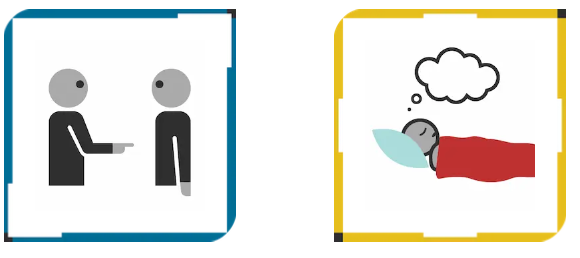
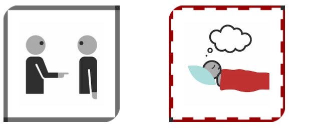

# IKON Overview 

The ever-expanding IKON Set has been developed over the past 10 years, reaching 1000 icons. This growth is not random: the lexicon of IKON is built starting from a core set of around 500 icons covering basic concepts in most languages to more complex, but still frequent words.  
IKON is highly rooted in Esperanto vocabulary and structure. New icons are also created for side projects.

---

## Table of Contents

- [Type of Icons](#type-of-icons)  
- [Arrows, Lines, Circles](#arrows-lines-circles)  
- [People, Family, and Pronouns](#people-family-and-pronouns)  
- [Prepositions](#prepositions)  
- [Grammar](#grammar)  
- [Advanced Grammar](#advanced-grammar)  
- [Applications](#applications)  

---

## Type of Icons

### Semantic-graphic strategies

These are the basic strategies used to translate words into based on linguistic analysis and graphic optimization.

| Type of Icon | Description |
|--------------|------------|
| PICTOGRAPHIC | A prototypical and conventional type of an item. :bulb: Example: the most telling representation of a window. |
| SYMBOLIC | Symbols already used in the iconography of a specific domain (mathematics, road signs, genders, etc.). |
| HYPERONYMIC (Supertype) | Icons containing three to four elements to show :bulb: Examples of a larger category. :bulb: Examples: *wood + glass + paper → material*; a set of different species → *animal*. |
| HYPONYMIC (Subtype) | Highlights a specific member of the hyperonymic set. |
| CONTRASTIVE | Meaning emerges from comparing two concepts (often opposites). The intended meaning is marked with green thick line on the right (or top) according to icon orientation. |
| PROCESSUAL | Represents an event’s phases or stages. :bulb: Examples: *to take*, *to choose*. |
| TRANSFORMATIVE | Two or more scenes to show a process leading to a change of state. :bulb: Examples: *to get tired*: *is rested* + transformative arrow + *tired*. |
| CORRELATIVE | Two icons combined to form a compound word. :bulb: Example: *what + thing → what* |

---

## Arrows, Lines, Circles

| Symbol | Description |
|--------|------------|
| INDICATIVE ARROWS | Solid purple arrow indicating a specific object inside scenes with multiple objects. |
| INDICATIVE CIRCLES | Dashed purple circle indicating part of an object or group of elements. |
| TRANSFORMATIVE ARROWS | Solid purple arrow showing change of state from one state to another. |
| MOTION ARROWS AND LINES | Dashed purple arrows and lines help interpret motion and distinguish directions. |

---

## People, Family, and Pronouns

### People and Jobs

- Genderless and non-cultural human figures are gray (full, half body, or only hands).  
- Profession is indicated with a correlative icon by adding a qualifying element to the gray person.
  
### Pronouns
Personal pronouns are represented with people. Includes traditional pronouns plus inclusive “we” (me + you + possibly someone else) and exclusive “we” (me + someone else but not you). Pronouns use gray borders.

### Family

The family relationships include gender-specific as well as gender-neutral members.
The gender of the members is coded through hairstyle, symbols, and colour (blue and pink).
The member the icon refers to is coloured. An indicative arrow indicates the perspective of the relationship. :bulb: Example: from mother to son is mother; from son to mother is son.
The referenced member is colored and an indicative arrow shows the perspective. :bulb: Example: from mother to son → *mother*; from son to mother → *son*.

---

## Prepositions

Prepositions are mostly expressed with an orange ball in spatial relation to other elements (static: *in*; dynamic: *into*).

> [!TIP]  
> Other elements can act as prepositions depending on context.  
> :bulb: Example: *of* + noun in quantity expressions → *amount/quantity* icon in prepositional border.  
> :bulb: Example: *to give* in a prepositional border → dative *to*.

---

## Grammar

### Borders

IKON assigns colors and shapes to parts of speech. Each icon is contained in a colored border:  

- Yellow → Nouns  
- Red → Verbs  
- Blue → Adjectives  
- Orange → Adverbs  
- Green → Conjunctions and prepositions  
- Gray → Pronouns / indefinite elements  
- Plural → Overlapping three borders  

  <strong> :question: Question:</strong> Why are borders useful?

  <strong> :bulb:Example: Look at these sentences. Without the borders the difference in meaning would get lost. </strong>

 

*Your dream*
 

*You dream*
 

### Tenses

IKON expresses verbal tenses and are designed reflecting the Esperanto system. It uses timelines. 
 

The timeline is a modifier that can be added beneath each icon to indicate time through our web app. On this line, a central notch marks the present or time speech. Above the line, a purple dot or segment shows the time being indicated: past, present, or future. 

It also shows the verbal aspect: whether the action is punctual, continuous, or repeated. 
  - Dot: short or instantaneous event/action.
  - Segment: a long or continuous event/action 
  - Infinite timeless line: state as permanent fact; general truth.

 

Another vertical bar shows a point of reference, which is the time from which the event is viewed in more complex tenses such as a present perfect.

> [!NOTE]
> All tenses are in our web app text2Ikon and a full list of tense icons for English is forthcoming. They are designed to match other languages’ tenses.

### Negation

IKON uses a single negation form before the word:  

- *she no-NEG have-VERB interest in something* (completely lacks possession of interest)  
- *she no-NEG interested-ADJ in something* (focus on state)  
- *she no-NEG (is-VERB) happy-ADJ*  
- *No-NEG go-VERB* (do not go)

---

## Time

### Time-related Words

IKON has the most relevant words to express time using various semantic-graphical strategies:
Includes: day, night, morning, afternoon, evening, today, tomorrow, yesterday, week, weekend, month, year, seasons, hours, minutes, seconds.

### Adverbs of Time

The adverbs of time are designed with a timeline + the clock as a qualifying element (classifier).
They describe when an action takes place or how frequently it happens.

---

## Quantifiers

- *All, some, none* expressed through contrastive icons (sets of circles with points; intended meaning is circled).

---

## Advanced Grammar

### Iconemes

Now that you have learned our words and principles, you can build more complex sentences by adding our iconemes.

An iconeme is a modifier with grammatical function which enriches the icon meaning.

Iconemes are:

* Gender markers: male/female symbols  
* Imperative: exclamation point  
* Conditional: yes/no/question mark  
* Time tenses: 19 verbal tenses 
* Case: semantic roles to mark the relationship between participants: agent (who?), patient (to whom?), reflexive, reciprocal  
* Reference: An asterisk marks an entity as the referent, and numbers (1-9) link following icons that refer back to that entity.

### Word Order
The visual nature of IKON makes it possible to use flexible syntactic approaches that reflect either the user’s native language or cognitive best practices, such as optimizing focus or reducing memory load.
- Flexible syntax: right-to-left, left-to-right, top-to-bottom, bottom-to-top
- Follow a 2d semantic schema: connect verb to its arguments

>  [!TIP]
>   Consider that the most relevant word orders are subject-object-verb (SOV) and subject-verb-object (SVO), the former being the most common.
 

### Semantic Predication – Mathematical Symbols

IKON uses symbols like ∈ and = to reflect different levels of relationship between concepts based on the context of the verb *to be*.

* Non-equivalence context:
  
Use the belonging symbol (∈) for the preposition *of* or the verb *belong*.

  
:bulb: Example: If "Paris belongs to the set of fascinating things," you would represent it as *Paris ∈ fascinating things*.
  

* Equivalence context:
  
When *to be* expresses equivalence (i.e., both concepts are interchangeable), use the equals sign (=).

  
:bulb: Example: In the sentence "Paris is the capital of France," the concepts "Paris" and "capital of France" are interchangeable, so it's represented as *Paris    = capital of France*.

---

## Applications

### Language Learning

- Support sentence construction, and syntax analysis especially for learners with communicative challenges
- Support vocabulary learning from simple nouns to verbal tenses through visualization
- Icons represent subjects, verbs, tense, objects, complements  

### Icons for Digital Platforms

- Promotes inclusive, comprehensible visual communication  
- Avoids abstract or meaningless icons

### Games

- Integrate IKON into roleplay games to provide narrative input  thanks to its wide vocabulary range with concrete and stimulating scenes 

---

